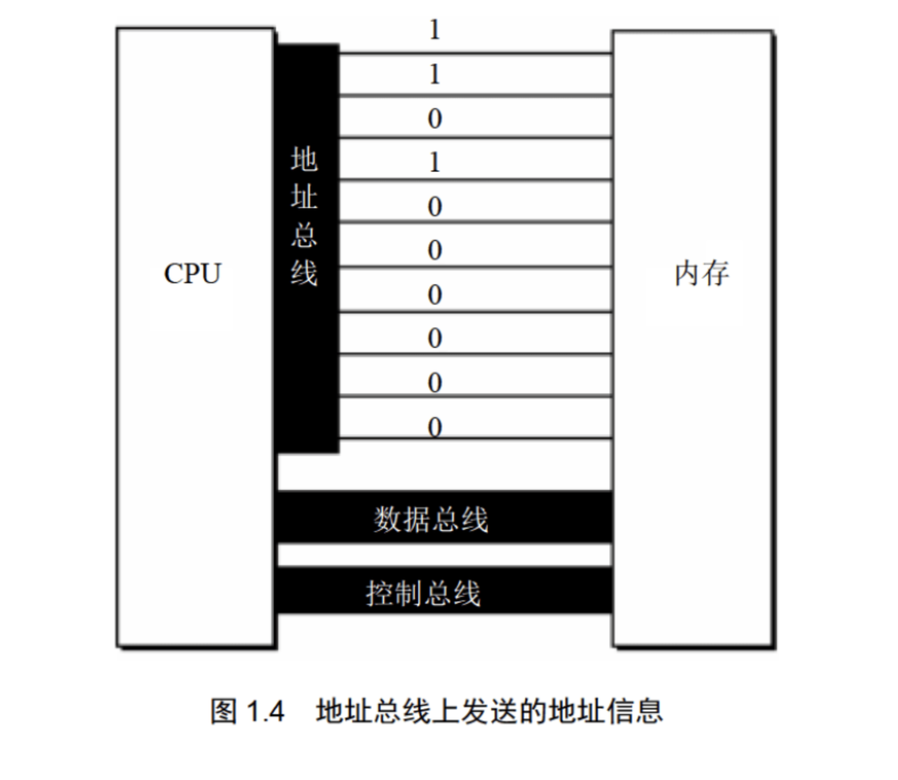
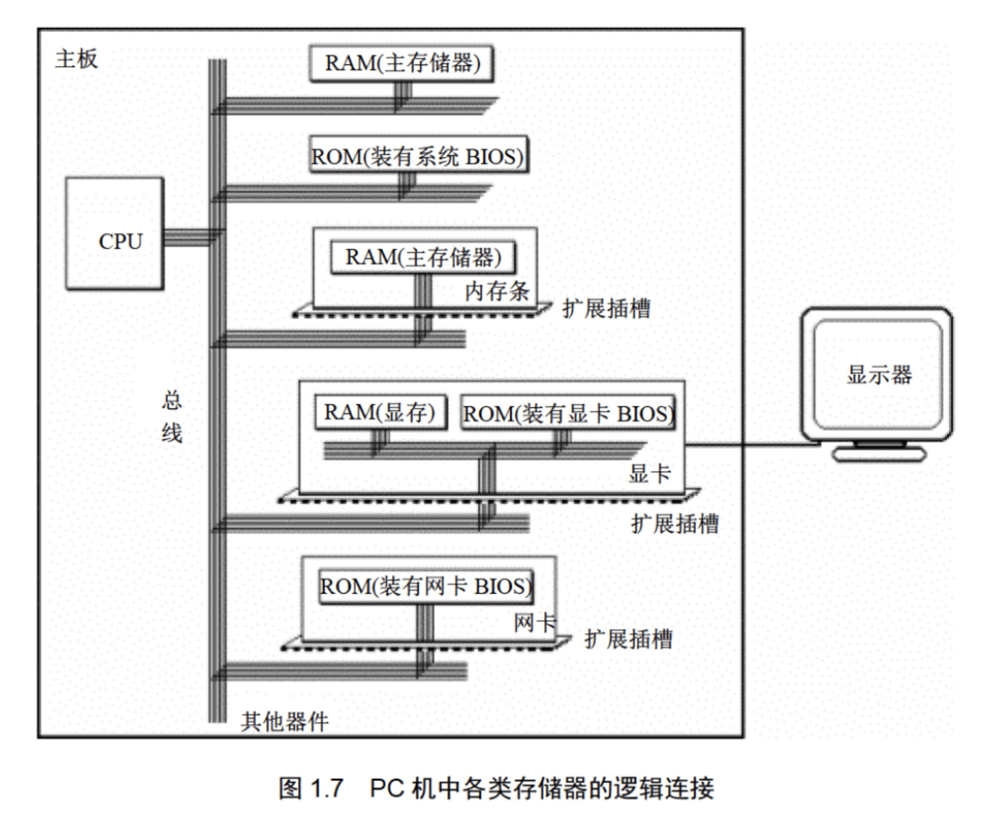
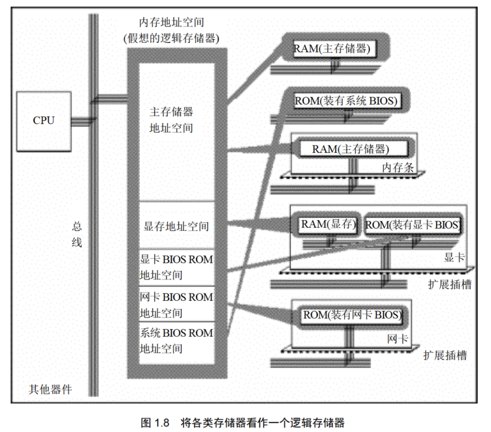
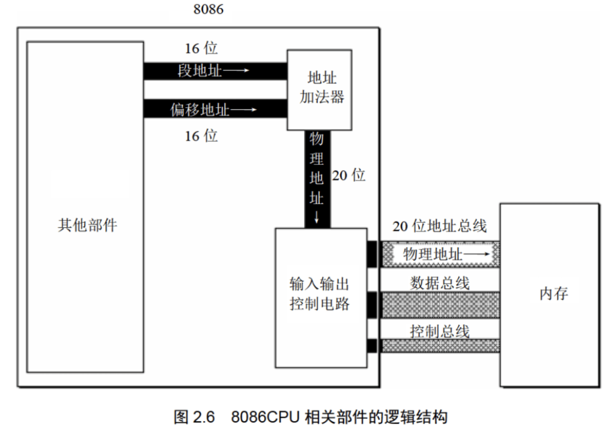
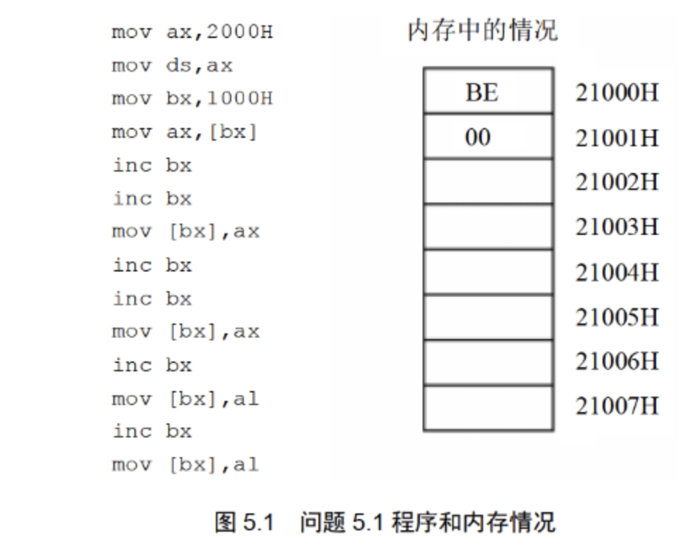
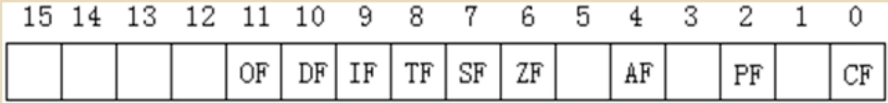

# **汇编语言**

## 8086CPU

##### 一、基础知识

###### 机器语言

- 通过纸带机或卡片机输入0-1代码
  - 冗长
  - 繁琐
  - 易出错
  - 不易读

###### 汇编语言产生

- 通过汇编指令编写程序
  - 便捷，相对高效
  - 编写的指令通过编译器转码成机器码、执行
- 汇编语言指令类型
  - 汇编指令：机器码的助记符，有相应的机器码（核心）
  - 伪指令：没有对应的机器码，由编译器执行
  - 其他符号：+、-、*、/等等，由编译器识别

###### 存储器

- CPU读取内存
- CPU读取、运算
- CPU写入内存

###### 指令和数据

- 应用上的概念
- 在内存或磁盘上，指令和数据没有区别

###### 存储单元

- 存储器被划分为若干单元
- 通常来说，一个存储单元存储1Byte（8bit）
  - 对存储元件：1KB=1024B，1MB=1024KB，1GB=1024MB，1TB=1024GB
  - 对于带宽 通常1Kb=1000bits ...

###### CPU对存储器的读写

- 实现读写
  - 存储单元的地址（地址信息）
  - 器件的选择，读或写的命令（控制信息）
  - 读或写的数据（数据信息）

###### 地址总线

- 地址总线数（N）决定了CPU寻址能力
- 寻址单元数（$2^N$）



###### 数据总线

- 数据总线的宽度决定了CPU与其他器件的每次数据传输量（传输速度）（N <---> N）
- 当宽度小于数据量时，分段传输

###### 控制总线

- 控制总线的数量决定了CPU对外部器件的控制能力

###### 主板

- 主板是CPU等核心器件与其他器件相连的通道
- CPU、存储器、外围芯片组、拓展卡槽（RAM内存条、各类接口卡）等

###### 接口卡

- CPU通过接口卡对I/O设备进行控制
- CPU和接口卡通过总线相连，实现CPU对其间接控制

###### 各类存储器芯片

- 随机存储器RAM（Random Access Memory）
  - 用于存放CPU的绝大部分程序和数据
  - 一般由主板上的RAM和扩展槽上的RAM组成
    - 典型的卡槽上的RAM有显存，应对大批量输入、输出数据的高速缓存
- 只读存储器ROM（Read Only Memory）
  - BIOS（Basic Input/Output System），由主板和各类接口卡厂商提供的软件系统，实现基本的输入输出



###### 内存地址空间

- 存储器在被CPU操控时被视为一个由若干单元组成的逻辑存储器
- 逻辑存储器即内存地址空间（Imaginational）
  - 不同的计算机的内存地址空间的分配不同（即主存储器、显存、各类ROM的大小空间是不同的）




##### 二、寄存器

###### 通用寄存器

- 8086CPU的所有寄存器都是16位的，可以存放两个字节
- AX、BX、CX、DX通常用来存放一般性的数据，即通用寄存器
- 为了向下兼容
  - AX、BX、CX、DX可以分为高位、低位，即AH、AL等

###### 字在寄存器中的存储

- 同样由于向下兼容，8086CPU可以一次处理两种尺寸数据
  - 字节：1 byte（8bit）
  - 字：1 word （16bit）高字节和低字节位对应AH、AL

###### 几条简单的汇编指令

| 汇编指令  | 控制CPU完成的操作            | 高级语言描述 |
| --------- | ---------------------------- | ------------ |
| MOV AX,18 | 将18存入寄存器AX             | AX=18        |
| MOV AH,78 | 将78送进寄存器AH             | AH=78        |
| ADD AX,8  | 将寄存器AX中的数值加8        | AX=AX+8      |
| MOV AX,BX | 将寄存器BX中的数据送入AX     | AX = BX      |
| ADD AX,BX | 将AX和BX中的数值相加，存入AX | AX=AX+BX     |

- 一般来说汇编语言使用的数值偏向于16进制，便于表示

###### 物理地址

- 每个内存单元对应存储器中的唯一地址（线性的）
- 不同的CPU可以有不同的形成物理地址的方式

###### 16位结构的CPU

- 运算器一次处理16位数据
- 寄存器最大宽度16位
- 寄存器与运算器之间的通路16位

###### 8086CPU的地址映射方式

- 8086CPU有20位地址总线

- 采用16位段地址和16位偏移地址

  - 通过$段地址\times16+偏移地址$来映射物理地址

    

###### 段的概念

- 根据需要，在编程时虚设的概念

###### 段寄存器

- 8086CPU有四个段寄存器
- **CS、DS、SS、ES**
- CS：IP是8086CPU中最关键的寄存器
  - CS为代码段寄存器
  - IP为指令指针寄存器
  - CS（data：M），IP（data：N）
    - CPU将从$M\times16+N$开始读取一条指令并执行
    - CPU将CS：IP指向的内容当作指令执行
    - 执行完一条指令IP**自动加上执行指令长度**以实现跳转到下一条指令
  - 8086CPU开机后，CPU从FFFF0H单元读取第一条指令并执行

###### 修改CS、IP的指令

- 指令：

  ```assembly
  JMP  CS:IP 
  ```

- 须是合法的寄存器

- JMP指令类似于C语言中的```goto()```易引起错乱、死循环等

###### 代码段

- 根据需要，可将一组内存单元定义为一个段

  ```assembly
  MOV AX,0000H
  ADD AX,0123H
  MOV BX,AX
  JMP BX
  ```

  - 此段长度为10Byte的指令，存放在123B0H～123B9H的一组内存单元，即为代码段


##### 三、寄存器（内存访问）

###### 内存中字的存储

- 用0、1号单元存储一个字
  - 高位放在1，低位放在0（小端）
- 字单元，即存储一个字的两个内存单元

###### **DS** 和 **[address]**

- DS寄存器通常用来存放**即将访问数据的段地址**
- 而[address]（如[0]）表示一个内存单元，其中的address（' 0 '）表示内存单元的偏移地址
  - "[ ]"说明操作对象是一个内存单元，"address"表示内存单元的**偏移地址**是'address'

- 在执行指令时，CPU自动取DS中的数据作为段地址
- 另外，8086CPU不支持直接将数据送入段寄存器的操作（可能是硬件层面问题，[见知乎大佬解答](https://www.zhihu.com/question/43608287)）

###### 字的传送

- 8086CPU数据总线宽度为16位，一次可传送16个bit，即一个字

###### MOV、ADD、SUB指令

- mov     register,                    data

  ```assembly
  mov ax ,8
  ```

- mov     register,                    register

  ```assembly
  mov ax,bx
  ```

- mov     register,                    memory-unit

  ```assembly
  mov ax,[0]
  ```

- mov     memory-unit,            register

  ```assembly
  mov [0],ax
  ```

- mov     segment-register,     register

  ```assembly
  mov ds,ax
  ```

- add和sub 与mov指令一样

  - [ ] add ds,ax?

- 上述指令对register来说是双向的

###### 数据段

- 根据需要，自定一组内存单元为一个段
- 用DS存放数据段的段地址

###### 栈

- LIFO

###### CPU提供的栈机制

- 指令
  - POP 、 PUSH
- CPU如何知道当前执行指令所在的位置（栈顶位置）
  - `SS:SP`指向栈顶元素
  - 当执行`push`指令时，SP=SP+2
  - 当`pop`时，SP=SP-2
  - 栈空时，SS:SP指向栈底

###### 栈顶超界问题

- 8086CPU并不会保证对栈的操作不会超界，栈的最大容量为64KB

###### PUSH、POP指令

- PUSH and POP

  ```assembly
  push register
  pop regiter
  
  push segment-register
  pop segment-register
  
  push memary
  pop memary 
  ```

  

###### 栈段

- 直接使用`mov ss,ax`可能会出现越界错误，由于CPU的保护模式

##### 四、第一个程序

###### 写出--->执行

- edit
- link
- run

###### 源程序

- 伪指令
  - `xxx segment` 与end 一块定义一个段，段始标志
  - `xxx end`  段末标志
    - ends是与segment成对使用的
    - end 是整个程序结束标志
  - `assume`
    - “假设” 将有特定用途的段和相关的段寄存器关联起来
- 源程序中的“程序”

- ###### 标号

  - 作为段名称

- ###### 程序结构

  - 

    ```assembly
    assume cs:abc
    abc segment
    mov ax,2
    add ax,ax
    add ax,ax
    abc ends
    end
    ```

    

- ###### 程序返回

  - 

    ```assembly
    mov ax ,4c00H
    int 21H
    ```

    

- ###### 语法错误和逻辑错误

  - 逻辑错误很难纠错

###### 编辑源程序

- dos中运行edit
  - 编辑保存为file.asm
- 键入`masm file.asm` 
  - 输出文件为file.obj
- 键入`link file`
  - 输出file.exe
- 键入`debug file.exe`
  - 跟踪显示运行
  - 使用`-t`
  - 直到 `INT 21`时用`p`结束


##### 五、[BX]和loop指令

###### [BX]

```assembly
mov ax,[bx]
```

- `bx` 中存放的数据作为偏移地址EA
- 段地址SA默认在DS中
- 将`SA:EA`处的数据送入ax中
- 即`(ax) = ((ds)*16 + (bx))`

```assembly
mov [bx],ax
```

- bx中存放的数据作为偏移地址EA
- 段地址SA默认在DS中
- 将ax中的数据送入内存`SA:EA`中
- 即`((ds)*16 + (bx)) = (ax)`



- `bx`内容自动加1

  ```assembly
  inc bx
  ```

###### loop

- 格式`loop s`

- 标号`s`实际上标识的是一个地址

- 执行`loop s` 时，CPU须执行两步：

  - `(cx) = (cx)-1`
  - 判断`cx`中值，不为0则转至标号处执行指令

  ```assembly
  mov cx ,5
  mov ax ,2
  s:
  	add ax,ax
  loop s
  ```

- 在汇编程序中，数据不能以字母开头即`ffffH`应为`0ffffH`

- `loop` 和` [BX]`可以实现**连续地址的内容**的处理

###### debug 和 汇编编译器MASM对指令的不同处理

- debug
- masm编译的程序需要申请段、中断程序	


###### 段前缀	

- 用于显式的表示内存单元的段地址

```assembly

mov ax, ds:[bx]
mov ax, cs:[bx]
mov ax, ss:[bx]
mov ax, es:[bx]
mov ax, ss:[0]
mov ax, cs:[0]

```

###### 代码访问内存空间的安全性

- 随意访问内存单元可能会造成危害
- 内存单元可能存储着系统数据或代码
- 在CPU保护模式下的操作系统，一般不会直接访问重要的内存

##### 六、多段程序

- 一段空间一般包含64byte的容量
- 如果段超过64byte ，如256byte就需要申请段
- 分多段（数据段、代码段、栈段等等）

###### 数据和代码段

- 使用`start`和`end start` 来隔绝数据和代码

  ```assembly
  assume cs : code 
  
  code segment 
  					|
  					|
  					;data
  					|
  					|
  start : 
  					|
  					|
  					;code
  					|
  					|
  
  code ends
  
  end start
  ```

###### 代码段中使用栈

- 将栈操作放在代码段中

###### 代码、数据、栈分段放入

- 通过`cs:code` `ds:data ` `ss:stack` 实现对三个段的封装
- 不可以`mov ds data`（data为段数据）不能直接将数据mov到寄存器ds中


##### 七、灵活定位内存的方法

###### `and` 和`or`指令

- `and`逻辑与，按位与运算

  ```assembly
  mov al ,01100011B
  and al ,00010010B
  ```

  

- `or`  逻辑或，按位或运算

  ```assembly
  mov al,01100011B
  or al,00010010B
  ```

###### ASCII码（美国标准信息交换码）（常见的）

| Hex Code | Normal Language |
| :------: | :-------------: |
|   41H    |        A        |
|   61H    |        a        |

###### 以字符的形式给出数据

- data段的数据为`db 'unix' ...` 会转码成ASCII码

###### 大小写转换

- 观察规律，在**二进制**位的**第五位为0** 就是大写字母，为**1** 则就是小写字母
- 用`and` 和 `or`指令来操作使其相互转化

###### `[bx+idata]` 

- `mov ax,[bx+idata]` 表示一个内存单元，偏移地址为`(bx) + idata` 	
- 即为 `(ax)  = ((dx)*16 + (bx)+idata)`
- 常见格式如下
  - `mov ax , [bx+200]`
  - `mov ax , [200+bx]`
  - `mov ax , 200[bx]`
  - `mov ax , [bx].200` 
- 通过`200[bx]` 的方式，可以实现类似高级语言中的数组机制
  - C : 	`a[i] , b[i]`
  - ASM: ` 0[bx] , 5[bx]`

######  `SI ` 和`DI` 

- `SI` 和`DI` 在8086CPU中，与`BX` 的功能相近
  - 因此可以用`SI` 来取代`[BX]`中的bx
- `SI` 和 `DI` 不能分成两个8位的寄存器

###### `[bx+si] `和 `[bx+di]` 相似

- 表示一个内存单元
- 偏移地址为`(bx) +(si)`
- 对于`mov ax,[bx+si]` 数学化描述为` (ax) = ((dx)*16+(bx)+(si))`
  - `mov ax,[bx+si]`<==> `mov ax [bx][si]`

###### `[bx+si+idata]`和`[bx+di+idata]`

- 同样的，`[bx+si+idata]`也表示一个内存单元
- 偏移地址为`(bx)+(si)+idata`
- 段地址在`ds`中，偏移地址为`bx` 中的数值加上`si` 中的数值，再加上`idata`的数值
- `mov ax,[bx+si+idata]`数学化描述为`(ax)= ((ds)*16+(bx)+(si)+idata)`
- 也可写成以下格式：
  - `mov ax,[bx+200+si]`
  - `mov ax,[200+bx+si]`
  - `mov ax,200[bx+si]`
  - `mov ax,[bx].200[si]`
  - `mov ax,[bx][si].200`

##### 八、数据处理的两个基本问题

- `reg` 和 `sreg` （寄存器和段寄存器）
  - reg: ` ah,al,ax,bh,bl,bx,ch,cl,cx,dh,dl,dx,sp,bp,si,di`
  - sreg:`ds,cs,ss,es`

###### `BX` 、`SI`、 `DI`、 `BP`

- 如下的指令是错误的指令

  ```assembly
  mov ax,[cx]
  mov ax,[ax]
  mov ax,[dx]
  mov ax,[ds]
  
  ```

- 即，在`[...]`中只能出现`bx,si,di,bp,idata`

  - 并且只有以下的组合
    - `bx ` & `si` 
    - `bx` & `di`
    - `bp` & `si`
    - `bp` & `di`

- 只要在`[...]`使用`bp` 而指令没有显式的给出段地址，段地址就默认存储在`ss`中

###### 处理的数据在什么地方

|  机器码  | 汇编指令   |  执行前数据的位置   |
| :------: | ---------- | :-----------------: |
| 8E1E0000 | mov bx,[0] |   内存，ds:0单元    |
|   89C3   | mov bx,ax  |  CPU内部，ax寄存器  |
|  BB0100  | mov bx,1   | CPU内部，指令缓冲器 |

###### 三种数据位置表达

- 立即数（`idata` ）

  ```assembly
  mov ax,1
  add bx,2000h
  or bx,00010000b
  mov al,'a'
  ```

  

- 寄存器（...）

  ```assembly
  mov ax,bx
  mov ds,ax
  push bx
  mov ds:[0],bx
  push ds
  mov ss,ax
  mov sp,ax
  ```

  

- 段地址和偏移地址（`SA:EA`）

  - 默认存储在`ds`中

    ```assembly
    mov ax,[0]
    mov ax,[di]
    mov ax,[bx+8]
    mov ax,[bx+si]
    mov ax,[bx+si+8]
    ```

  - 默认存储在`ss`中

    ```assembly
    mov ax ,ds:[bp]
    mov ax, es:[bx]
    mov ax,ss:[bx+si]
    mov ax,cs:[bx+si+8]
    ```

  ###### 寻址方式

  - 直接寻址  
    - `[idata]`
  - 寄存器间接寻址 
    - `[bx]`
  - 寄存器相对寻址  
    -  `[bx].idata` 用于结构体
    -  `idata[si] | idata[di] `用于数组
    - `[bx][idata]` 用于二维数组
  - 基址变址寻址
    - `[bx][si]` 用于二维数组
  - 相对基址变址寻址
    - `[bx].idata[si]`用于表格（结构）中的数组项
    - `idata[bx][si]`用于二维数组

  

  ###### 指令处理数据的长度

  - byte 和 word

  - 在没有寄存器名存在的情况下，用 `X ptr`指明内存单元的长度
  
    -  `byte ptr`
  
      ```assembly
      mov byte ptr ds:[0],1
      inc byte ptr [bx]
      inc byte ptr ds:[0]
      add byte ptr [bx],2
      ```
  
    - `word ptr`
  
      ```assembly
      mov word ptr ds:[0],1
      inc word ptr [bx]
      inc word ptr ds:[0]
      add word ptr [bx],2
      ```

###### 寻址方式的综合


```c
// c风格

struct company{
  char cn[3];
  char hn[9];
  int pm;
  int sr;
  char sp[3];
};
struct company dec = {"DEC","Ken Olsen",137,40,"POP"};

int main(){
  int i ;
  dec.pm = 38;
  dec.sr = dec.sr+70;
  i =0;
  dec.cp[i]='V';
  i++;
  dec.cp[i]='A';
  i++;
  dec.cp[i]='X';
  return 0;
}
```

用汇编改写：

```assembly
mov ax,seg
mov ds,ax
mov bx,60h

mov word ptr [bx].0ch,38
add word ptr [bx].ceh,70

mov si ,0 
mov byte ptr [bx].10h[si],'V'
inc si
mov byte ptr [bx].10h[si],'A'
inc si 
mov byte ptr [bx].10h[si],'X'

```

###### `div`指令

- 除数

  - 8位
  - 16位

- 被除数，默认放在 **AX** 或 **DX和AX** 中

  - 除数8位、被除数16位，则默认放在AX中存放
  - 除数16位、被除数32位，则DX存放高位，AX存放低位

- 结果

  - 除数8位，AL存储商、AH存储余数 
  - 除数16位，AX存储商、DX存储余数

- eg: 

  ```assembly
  mov dx,1
  mov ax,86A1h
  mov bx,100
  div bx
  ```

  执行后`(ax) = 03E8H ,(dx)=1`


###### 伪指令`dd` `db` `dw`

- `dd` 用来定义双字数据

  ```assembly
  data segment 
  dd 100001
  dw 100
  db 0
  data ends
  ```

- `db` ` dw` 用来定义字节型数据和字型数据

###### `dup` 

- `dup`是一个操作符，配合数据定义的伪指令使用

- 减少重复输入数据的冗余

  ```assembly
  ;times是数据的重复次数
  db times dup (0,1,2)
  dw times dup (0,1,2)
  dd times dup (0,1,2)
  ```


#####  九、转移指令

###### 操作符offset

- 功能，取得标号位的偏移地址

- `start: mov ax,offset start` 相当于`mov ax,0`

-  `s: mov ax,offset s`  相当于`mov ax,3`

  ```assembly
  assume cs:code 
  code segment
  
  start : mov ax,offset start 
  		s : mov ax,offset s
  		
  code ends
  
  end start 
  ```

  - `start `  和 `s` 就是其标号

###### `jmp`指令

- 无条件转移指令，可以修改`IP`或`CS:IP`
- `jmp 0:0x7c00` ......BIOS开始引导操作系统
- `jmp reg`
  - `jmp ax`  ...
- `jmp short s`
  - 实现段内短转移，范围**-128~127**
    - 超过范围会触发编译器的超界检测，从而报错
  - 可以替代`loop s`
- `jmp near ptr s`
  - 实现`(IP)=(IP)+16`位位移
  - 段内近转移
- `jmp far ptr s `
  - 段间转移（远转移）
- 转移地址在内存中的jmp使用
  - `jmp word ptr ds:[0]`段内转移
    - 功能：从内存单元地址处开始存放一个字，是转移的目的偏移地址
  - `jmp dword ptr ds:[0]`段间转移
    - 功能：从内存单元地址处开始存放着两个字
      - 高地址处的字是目的段地址 	`(CS) = (addr+2)`
      - 低地址处的字是目的偏移地址 `(IP) = (addr)`

###### `JCXZ`指令

- 有条件转移指令，短转移，IP修改范围**-128～127**
- 功能：JCXZ = JMP  CX  ZERO? 或者 `if ((cx)==0) jmp short s `
  - 通过`jcxz s0`和`jmp short s`可以实现`loop s`的替换

###### 根据位移进行转移的意义

- 对IP的修改是通过位移来确定地址，这种设计，便于程序段在内存中的浮动装配，方便程序的可移植性，即，在程序中使用相对地址，来规避s地址可能的改变
  - `jmp short s`
  - `jmp near ptr s`
  - `jcxz s`
  - `loop s`


##### 十、CALL和RET指令

###### ret和retf

- `ret`指令用栈中的数据，修改`IP`中的内容，从而实现近转移----> `POP IP`
  - `(IP) = ((SS)*16 + (SP))`
  - `(SP) = (SP)+2 `
- `retf`指令用栈中的数据，修改 `IP` 和`CS`中的内容，从而实现远转移 ----> `POP IP` + `POP CS`
  - `(IP) = ((SS)*16 + (IP))`
  - `(SP) = (SP) + 2`
  - `(CS) = ((SS)*16 + (SP)) `
  - `(SP) = (SP) + 2 `

###### `call`指令

- `call`指令通过位移转移，可实现子程序唤醒
  - `POP IP (POP CS:IS)`
  - `JMP CS:IP (JMP IP)` <==> `JMP near ptr s`
- CPU执行`call s`时（将IP压入栈、转到标号处执行指令）进行的如下操作
  - `(SP) = (SP) - 2  ` ----> `((SS)*16 + (SP)) = (IP)`
  - `(IP) = (IP) + 16`位 位移
- `call far ptr s`实现段间转移
  - <==>  `push CS `----> `push IP` ----> `jmp far ptr s`
    - `(SP) = (SP) - 2 ` ----> `((SS)*16 + (SP)) = (CS)` ----> `(SP) = (SP) - 2 ` ----> `((SS)*16 + (SP)) = (IP)` 
    - `(CS) = (CS(s))` ----> `(IP) = (IP(s))` 
- `call reg(16 bit)` 
  - <==> `push IP` ----> `jmp reg(16 bit)`
  - 功能：
    - `(SP) = (SP) - 2`
    - `((SS)*16 + (SP)) = (IP) `
    - `(IP) = (reg(16 bit))` 
- `call word ptr ds:[idata]`
  - <==> `push IP` ----> `jmp word ptr ds:[idata]` 
  - 功能：
    - `(SP) = (SP)-2` 
    - ...
- `call dword ptr ds:[idata]` 
  - <==> `push CS` ----> `push IP` -----> `jmp dword ptr ds:[idata]` 
  - 功能：
    - `(SP) = (SP) - 4 ` 
    - ...

###### `call` 和 `ret`指令配合使用

- 两个指令的配合实现了调用和返回的效果
- 由call指令将下一条指令IP push到栈，调用子程序
- 再由ret指令将pop 到IP实现返回

###### `mul` 指令

- 8位和16位乘法，其中一个乘数默认放在AX（DX、AX）中
- `mul reg`  or  `mul ds:[addr]` 
  - `mul byte ptr ds:[0]`  --->  `(ax)=(al) * ((ds)*16+0)`
  - `mul word ptr [bx+si+8]`
    - ---> `(ax) = (ax)*((ds)*16 + (bx) + 8 )` (lower 16) 
    - --->`(dx) = (ax)*((ds)*16 + (bx) + 8 )` (higher 16)

###### 模块化设计

模块化设计应该考虑参数处理等一定的事务

- 参数存储
- 期望返回值存储
- 寄存器冲突
  - 子程序使用的寄存器可能在主程序中也在使用
  - 可以在子程序调用前使用栈来存储寄存器数据


##### 十一、标志寄存器

###### 8086CPU的flag寄存器的结构



- flag中0、2、4、6、7、8、9、10、11位具有特殊的含义


###### ZF标志（zero flag）

- 零标志位（第 6 位）
- 运行相关指令后，判断其结果
  - 结果不为0，则`ZF = 0` 反之，`ZF = 1`
- `ZF`可能产生变化的指令：add、sub、mul、div、inc、or、and...（mov、push、pop...很难产生ZF变化）

###### PF标志（prime flag）

- 奇偶标志位（第 2 位）
- 运行相关指令后，判断结果
  - 偶数个1，`PF=1`  ；	奇数个1，则`PF = 0 `

###### SF标志（symbol flag）

- 符号标志位（第 7 位）
- 运行相关指令后，判断结果
  - 结果为负，`SF=1` ； 结果为正，`SF = 0`

###### CF标志 （carry flag）

- 进位标志位（第 0 位）
- 用CF来标志溢出进位和借位减法
  - 产生进位或借位，`CF=1` ,否则，`CF = 0 `

###### OF标志 （over-full flag）

- 溢出标志位（第 11 位）
- 记录结果是否发生溢出
  - 溢出，则`OF=1`否则`OF=0`

###### adc标志

- 带进位的加法指令
- `adc ax, bx` ----> `(ax)=(ax)+(bx)+CF`

###### sbb标志

- 带借位的减法指令
- `sbb ax, bx`-----> `(ax)= (ax) -(bx) -CF`

###### cmp标志

- 比较指令
- `cmp ax , ax` -->  ZF  PF  SF  CF  OF
- ax = 8,bx = 3 -> `cmp ax ,bx` --> ...
  - if ax = bx , ZF =1
  - if ax ≠ bx , ZF =0
  - if ax < bx , CF =1
  - if ax ≥ bx , CF =0
  - if ax > bx , CF=0 && ZF=0
  - if ax ≤ bx , CF =1 ||  ZF =1
- 不修改寄存器的值，只改变flag中的值


##### 十二、内中断

###### 中断的产生

* 除法错误： 0
* 单步执行： 1
* 执行`into` 指令 ： 4
* 执行`int`  指令 ： `int [num]`

###### 中断处理程序

- CPU收到中断信息后，需要对中断信息进行处理
- CPU在收到中断信息后，转去执行该中断信息的处理程序

###### 中断向量表

- CPU用8位的中断类型码通过中断向量表来找到对应的中断处理入口
- 中断向量表中存放了256个中断源来对应中断处理程序的入口
- 中断向量表的位置必须是固定的，方便CPU读取
  - 8086CPU中，中断向量表存放在内存地址0处，即从`0000:0000` 到`0000:03FF`单元

###### 中断过程

- CPU在收到中断信息后，先引发中断过程，由[硬件在完成中断过程](./POCC.md/#)后，`CS:IP` 指向中断处理程序入口
- 与`call`指令类似的，执行中断后，要恢复原来程序运行，就需要将原本的`CS:IP`进行入栈操作，如下
  - 从中断信息获取中断类型码
  - 标志寄存器入栈
  - 设置`TF`、`IF`值为0 
  - `CS`入栈
  - `IP`入栈
  - 取中断向量表中对应的地址放入`CS:IP` 

###### 中断处理程序和`iret`指令

- CPU随时都可能检测到中断信息，因此中断处理程序必须一直存储在某段空间中
- 中断处理程序的编写方法与子程序相似
  - 保存用到的寄存器
  - 处理中断
  - 恢复用到的寄存器
  - 用`iret`指令返回，`iret`指令的描述
    - `pop IP`
    - `pop CS`
    - `popf`
- `iret`通常与亦凝见自动完成的中断过程相配合使用

###### 除法错误中断的处理

- 0号中断处理

  - 当CPU执行div等除法指令的时候，如果发生了除法溢出错误，将会产生中断类型码为0的中断信息
  - 提示Divide overflow，返回操作系统中

- 编程处理0号中断

  - 当除法溢出发生时，在屏幕中间显示"Overflow",返回dos
    - [div_error.asm](../files/asm_code/div_error.asm)			
    
  - 在执行过此程序后，再去执行其他程序，出现0溢出会转而显示此程序的结果
  
    - 不可以将字符串信息存储在data段中，因为执行程序后，可能会被其他的程序覆盖或清除


###### 单步中断

- 如果没有单步中断，根本无法与计算机CPU实现交互
- CPU在执行完一条指令后，如果检测到标志寄存器的TF位为1则产生单步中断，所以debug时使用`-t`
- 那么在CPU执行中断后、中断程序前一定要将TF置为0，否则在转去其他程序执行时，会卡在   执行中断->转去执行第一条命令->执行中断  这一过程

###### 响应中断的特殊情况

- 有些情况下，即使发生中断，CPU也不会响应

  - ss寄存器传送数据的指令后，ss:sp联合指向栈顶，而对它们的设置应该连续完成，因此：

    ```assembly
    mov ax,1000h
    mov ss,ax
    mov sp,0
    ```

- 注意即可


##### 十三、int指令

- `int`类型引发的内中断

###### `int`指令

- 中断过程如下
  - 取中断类型码n
  - 标志寄存器入栈
  - `CS:IP`入栈
  - `(IP) = (n*4),(CS)= (n*4 + 2)`
- 我们可以用`int`指令调用系统提供的程序，也可以调用自己编写的程序


###### 编写供应用程序调用的中断例程

- 求word型数据的平方
  - [word^2.asm](../files/asm_code/word^2.asm)
  
- 将全是字母，以0结尾的字符串转为大写
  - [capital_7ch.asm](../files/asm_code/capital_7ch.asm) & [ts_capital_7ch.asm](../files/asm_code/ts_capital_7ch.asm)
  
  

###### 对`int` `iret` 栈的深入理解

- 使用`iret`可以在中断过程中从栈中获取 相应的段地址和便宜地址  并放入`CS:IP`中


###### BIOS和DOS中断例程

1. 系统主板中的ROM中有专门存放BIOS（Basic Input & Output System）的部分

   BIOS内容：

   - 硬件系统的检测和初始化程序

   - 外部中断和内部中断的中断例程

   - 对硬件设备进行基本的输入输出的中断例程

   - 其他硬件相关的中断例程

2. 操作系统DOS页提供了中断例程，是面向程序员的编程资源
3. 可以使用int指令直接调用DOS和BIOS提供的中断例程，来完成工作
4. 安装历程：
   - CPU开机加电，初始化`(CS)=0FFFFH (IP)=0`自动从`FFFF:0`单元开始执行程序，其中有一条跳转指令，转去执行BIOS的硬件系统检查和初始化程序
   - 初始化程序将会建立BIOS所支持的中断向量（BIOS固化在ROM中，中断向量一直在内存中存在）
   - 初始化完成后，调用`int 19H`进行操作系统的引导，将计算机交由操作系统控制
   - DOS启动后，除完成其他工作，将其提供的中断例程装入内存，建立对应的中断向量
5. [BIOS中断向量表](https://zh.wikipedia.org/wiki/BIOS%E4%B8%AD%E6%96%B7%E5%91%BC%E5%8F%AB#BIOS_%E4%B8%AD%E6%96%B7%E5%90%91%E9%87%8F%E8%A1%A8)
6. [DOS中断向量表](https://blog.csdn.net/xiaobai_2511/article/details/72898400)


##### 十四、端口

- CPU在操控各种存储器时，将其全部当成内存来对待
- 除CPU外，PC中还存在各类芯片通过总线与CPU相连
  - 接口卡（网卡、显卡等）上的芯片
  - 主板上的接口芯片
  - 其他
- CPU通过各类芯片内部的寄存器作为端口访存


###### 端口的读写

- CPU通过6最多4KB个不同的地址编码来定位端口
- 端口只有两条指令`in ` 和 `out` 
  - 其对应着在读取执行指令中的数据（包括地址信息）流通

###### CMOS RAM Chip

- CMOS包含有一个实时钟和一个有128个存储单元的RAM存储
- 依靠电池供电
- 实时钟占用0～0dh来保存时间信息，其余大部分是系统配置，供系统启动是BIOS读取
  - 存放着当前时间：年、月、日、时、分、秒。（1个字节）
  - 以BCD码方式存储
- CPU通过读写70H和71H两个端口来读写CMOS
  - 70H为地址端口
  - 71H为数据端口

###### 循环移位

- `shl` & `shr`
- 左右移位，低位（高位）补0 ， 进位写入CF


##### 十五、外中断

CPU外部的中断请求

###### 外中断信息

- 可屏蔽中断
  - 包含在当先CPU执行过程中，不能被插入执行的指令等申请中断CPU转去执行的操作
  - 可以被屏蔽即意味着CPU执行操作存在优先级
  - 设置指令`STI` -> IF=1 , `CLI` -> IF=0 （set if，clear if）

- 不可屏蔽中断
  - CPU必须对中断请求作出响应
  - 意味着十万火急无论如何都要中断（如电量不足即将关机，CPU必须响应中断，强制执行保存之类的操作）

###### 键盘中断

-  键盘输入
  - 每一个按键对应一个开关
- 9号中断
  - 键盘输入到达60h端口时，芯片响应发出中断码9的可屏蔽中断信息到CPU
  - CPU检测到信息，响应转而执行9号中断例程


##### 十六、直接定址表

使用表的方式，节省挨个查找数据地址的复杂操作

在8086CPU中有许多表示表中地址的方法，如：$表示当前地址......


## Dosbox 实操

| 命令 | 内容                                                         |
| ---- | ------------------------------------------------------------ |
| R    | 查看、改变CPU寄存器内容                                      |
| D    | 查看内存中的内容                                             |
| E    | 改写内存中的内容                                             |
| U    | 将内存中的内容单一为汇编指令                                 |
| T    | 执行一条机器指令                                             |
| A    | 以汇编指令格式在内存中写入一条机器指令                       |
| P    | debug 一个可执行的程序中断（int 21h）时，以结束程序（仍在debug内） |


###  实验九

###### 显示

通常情况下，显示器缓冲区分为8页

默认显示第0页

即通常情况下，B8000H ~ B8F9FH 中的4000个字节的内容将出现在显示器上

- 偏移000 ~ 09F对应显示器的第一行（80个字符占160个字节）
- 00 ~ 01单元对应显示器上的第一列（以此类推，9E ~ 9F 对应第80列） 

###### 属性字节格式

` 7	 6	5  4	3	 2	1  0 `

 <u>BL</u> 	<u> R  G  B</u>     	I   		<u>R  G  B</u> 

闪烁	  背景		高亮   	 前景

- eg: 
  - 红底绿字：01000010B
  - 红底闪烁绿字：11000010B
  - 红底高亮绿字：01001010B
  - 黑底白字：00000011B
  - 白底蓝字：01110001B


## Apple Silion M

>  ps:我使用的是M系列芯片的Mac, 学习8086CPU的汇编语言时，相关文件见files中的[dosbox_for_MacOS](../files/dosbox_for_MacOS/dosbox_needed.md)


